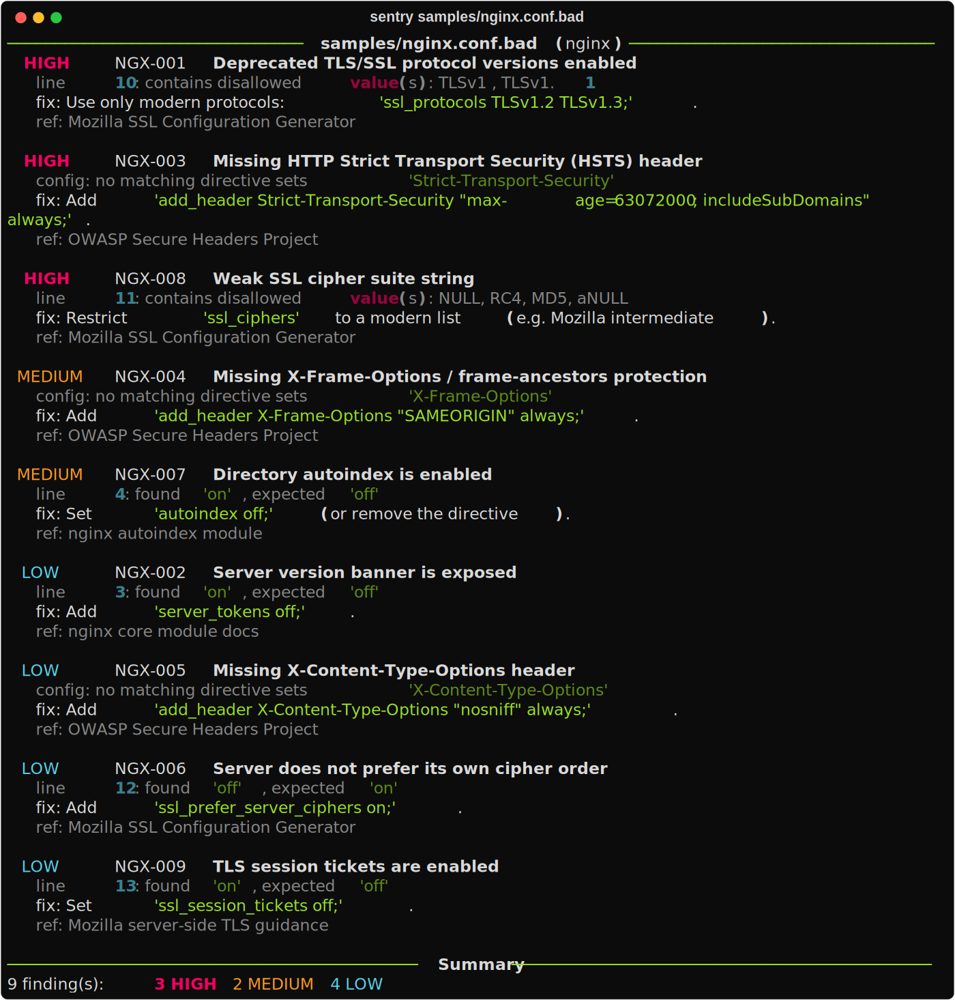

# Sentry

A **3-in-1 static security configuration linter**: one data-driven engine that
checks `sshd_config`, nginx, and `docker-compose` files for insecure settings,
insecure defaults, and missing hardening directives, and reports each issue with
a severity, an explanation, and a fix.

Built by **Hood Security Department** — NSSECU2 (S04).

---

## Tool Name

**Sentry** — a static security configuration linter.

## Description

Sentry reads a configuration file, compares it against a ruleset of known
security problems, and prints a ranked list of findings. It is **static analysis
only**: it reads configuration *text* and never connects to, scans, probes, or
tests any running system, service, or network.

It handles three unrelated config syntaxes behind a single engine:

| Config type | Example file | What it checks |
|-------------|--------------|----------------|
| `sshd` | `sshd_config` | OpenSSH server hardening (root login, auth, ciphers, timeouts) |
| `nginx` | `nginx.conf` | TLS versions, ciphers, security headers, information disclosure |
| `docker-compose` | `docker-compose.yml` | Privileged containers, host namespaces, capabilities, hardcoded secrets |

## Purpose

Misconfiguration — not exotic exploits — is one of the most common causes of real
breaches. Sentry exists to catch those mistakes *before* deployment, in a way
that is safe to run anywhere (it touches no live system) and small enough that a
student team can read and explain every line of it.

## Features

- **One engine, three formats.** sshd, nginx, and docker-compose are normalized
  into the same internal shape, so a single rule engine evaluates all of them.
- **Rules are data, not code.** Every security check lives in a YAML file under
  `sentry/rules/`. Adding a check is a data edit, not a code change.
- **Severity ranking** — `critical` / `high` / `medium` / `low` / `info`.
- **Absence is a finding.** A missing hardening directive (relying on an insecure
  default) is reported, not just wrong values that are present.
- **Hardcoded-secret detection** for compose `environment:` values, which reports
  only the *variable name* (never the secret) and ignores healthy `${ENV_VAR}`
  references.
- **Three output formats:** colorized console, machine-readable JSON, and a
  self-contained offline HTML report.
- **CI-friendly exit codes** (`--fail-on`) so it can run unattended in a pipeline.
- **No network access at any point.** Fully offline.

## System Requirements

- **Python 3.10 or newer** (developed and tested on 3.12).
- `pip` to install two dependencies:
  - `pyyaml` (>= 6.0) — reads the YAML rulesets and compose files.
  - `rich` (>= 13.0) — colorized console output.
- Runs on **Linux, macOS, or Windows 11 / 10**. No internet connection is needed
  to run the tool; the network is only used once, during installation, to fetch
  the two dependencies from PyPI.

## Installation

Clone or unzip the project, then open a terminal in the project folder (the folder
that contains `pyproject.toml`).

### Option A — recommended (installs the `sentry` command)

```bash
# 1. Create and activate a virtual environment
python -m venv .venv

#    Linux / macOS:
source .venv/bin/activate
#    Windows (PowerShell):
.venv\Scripts\Activate.ps1

# 2. Install Sentry and its dependencies
pip install -e .

# 3. Confirm it works
sentry --version
```

### Option B — no install, just dependencies

```bash
pip install -r requirements.txt
python -m sentry --version
```

With Option B, use `python -m sentry ...` everywhere the examples below say
`sentry ...`.

> **Windows 11 note:** if PowerShell blocks `.venv\Scripts\Activate.ps1` with a
> "running scripts is disabled" message, run
> `Set-ExecutionPolicy -Scope CurrentUser -ExecutionPolicy RemoteSigned` once,
> then activate again. Full Windows steps are in the User Manual.

## Usage

```bash
# Scan a single file (type auto-detected from the name)
sentry samples/sshd_config.bad

# Scan several files of mixed types in one command
sentry samples/sshd_config.bad samples/nginx.conf.bad samples/docker-compose.bad.yml

# Force the config type (useful when the filename is unusual)
sentry my_config.txt --type sshd

# Show only high-severity issues and above
sentry samples/nginx.conf.bad --min-severity high

# Produce a shareable HTML report
sentry samples/nginx.conf.bad --format html --output report.html

# List every rule the tool ships with
sentry --list-rules
```

### Options

| Flag | Purpose |
|------|---------|
| `-t`, `--type` | Force a config type (`sshd`, `nginx`, `docker-compose`) instead of auto-detecting |
| `-f`, `--format` | Output format: `console` (default), `json`, or `html` |
| `-o`, `--output` | Write the report to a file instead of stdout |
| `--min-severity` | Hide findings below this severity (default: `info`) |
| `--fail-on` | Exit non-zero if any finding is at/above this severity (default: `high`) |
| `--list-rules` | Print every bundled rule and exit |

### Exit codes

| Code | Meaning |
|------|---------|
| `0` | No findings at or above the `--fail-on` threshold |
| `1` | Findings at or above the threshold |
| `2` | Usage/input error |

## Testing Environment

Sentry is safe to run on any machine because it only reads local text files. No
vulnerable VM or lab target is required.

The project ships with deliberately-weak fixtures in the `samples/` folder:

| File | Purpose |
|------|---------|
| `samples/sshd_config.bad` | An intentionally insecure SSH config (triggers many findings) |
| `samples/sshd_config.good` | A hardened SSH config (should report no findings) |
| `samples/nginx.conf.bad` | An intentionally insecure nginx config |
| `samples/docker-compose.bad.yml` | An intentionally insecure compose file |

To run the automated test suite:

```bash
pip install -e ".[dev]"   # installs pytest
pytest
```

## Sample Output

Scanning the weak SSH sample (`sentry samples/sshd_config.bad`) produces a
severity-grouped report; each finding shows the exact line, an explanation, and a
fix. A complete captured run is in **`SAMPLE_OUTPUT.txt`**, and a rendered HTML
report is in **`example-report.html`** (open it in any browser).



## Limitations

Sentry is a deliberately small, educational tool. It is **not** a replacement for
mature scanners, and it is honest about what it does not do:

- **Small ruleset.** ~29 rules across three formats; production tools like Checkov
  or Lynis carry thousands.
- **Directive-level, not full-context, nginx parsing.** It flattens nginx
  directives across blocks.
- **No CVE or version-vulnerability awareness.**
- **Pattern-based secret detection** can miss unusually-named secrets.
- **YAML findings have no line numbers** (line `0`).

## Future Improvements

- Add more config types (Dockerfile, Apache, PostgreSQL, Kubernetes manifests).
- Track line numbers for YAML findings.
- Add context-aware nginx parsing (per-`server` block scoping).
- A `--fix` mode that suggests or writes hardened values.
- Map findings to a framework (CIS / OWASP ASVS).
- User-supplied rule files via a `--rules` flag.

## Ethical Disclaimer

This tool was developed for **educational purposes only**. It must only be used in
**authorized and controlled testing environments**. Unauthorized testing against
real systems, public websites, or third-party services is strictly prohibited.

Sentry performs static analysis of configuration text you provide. It does not
connect to, scan, or test any live system. You are responsible for ensuring you
have permission to review any file you run it against.

## Group Members and Roles

Group: **Hood Security Department** — Course: **NSSECU2 (S04)**

| Name | Role |
|------|------|
| James Edsel Alvarez | Team lead & system architecture |
| Hans Gabriel Obcena | Rule engine & matcher design |
| Lorenzo Enrique Suerte | Configuration parsers (sshd / nginx / compose) |
| Jarick Klein Viray | Reporters (console / JSON / HTML) |
| Jeruel Fabricante | Testing, QA & documentation |

## Original Contribution

Our original contribution is a **data-driven linting engine that unifies three
unrelated configuration formats behind a single assertion vocabulary.** Instead of
writing one scanner per format, we normalize line-based (`sshd`), block-based
(`nginx`), and nested-YAML (`docker-compose`) configs into one flat directive
shape, so a single ~200-line engine evaluates all three. All security knowledge
lives as YAML data in `sentry/rules/`, which keeps the engine small enough for
every team member to explain and makes adding a check a one-line data edit.

Everything in this repository — the engine, the parsers, the rule schema, the
rulesets, and the reporters — is our own work. The tool depends on `pyyaml` and
`rich` as external libraries (we call them; we did not modify them) and forks no
existing project.

Two specific design decisions we made and can explain:
1. The hardcoded-secret detector reports only the **variable name**, never the
   secret value, and deliberately ignores `${ENV_VAR}` references to avoid false
   positives on healthy configs.
2. A **missing** hardening directive is treated as a finding in its own right,
   because relying on an insecure default is itself a security problem.
